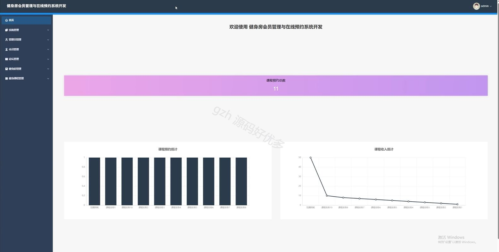
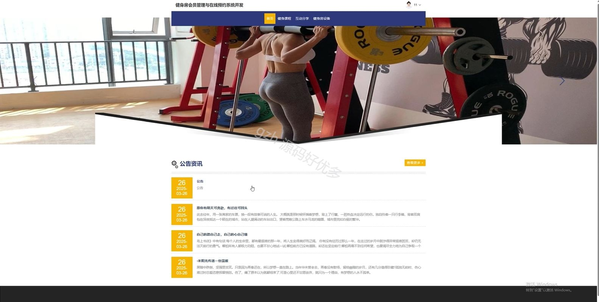
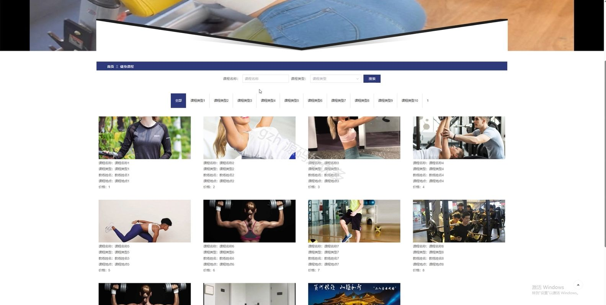
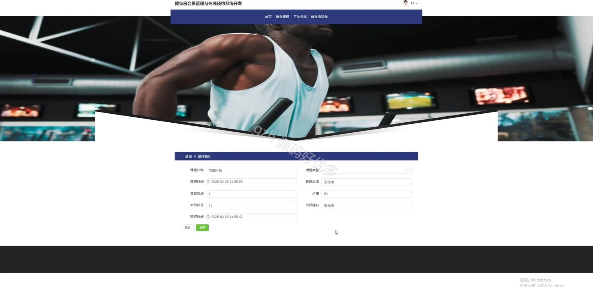
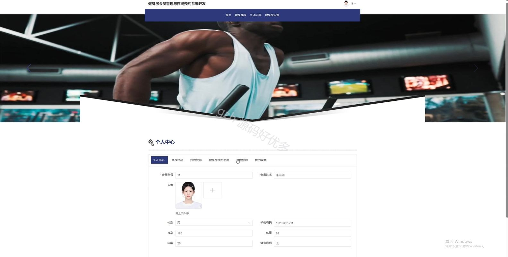
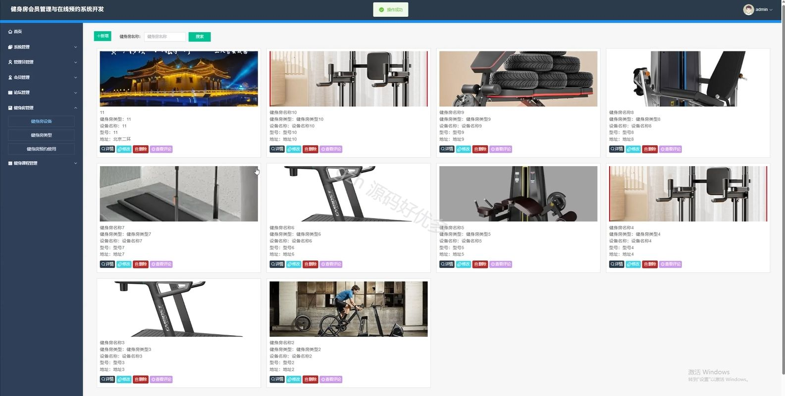
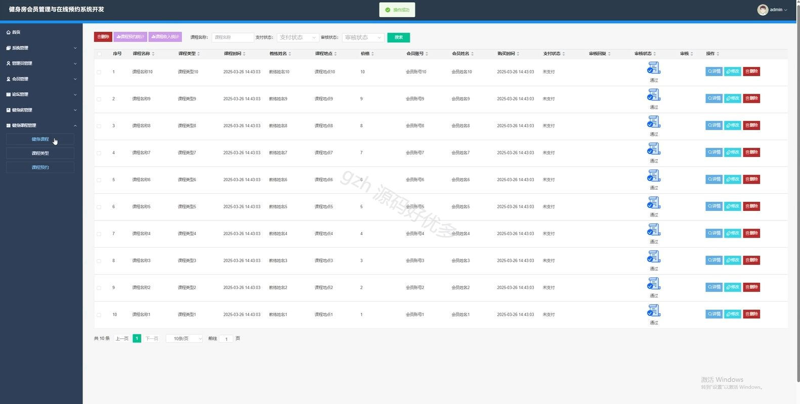
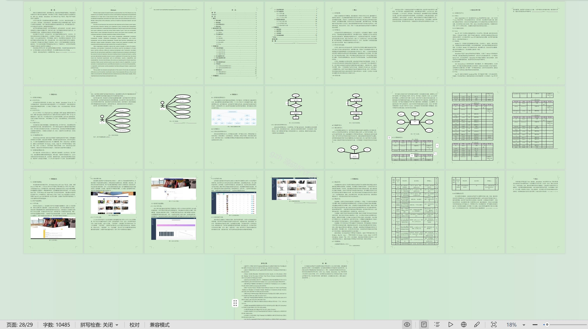

# springbootA385D
springbootA385D健身房会员管理与在线预约系统
## 查看主页获取源码

### 一、关键词

会员管理、预约系统、健身房管理

 

### 二、作品包含

源码+数据库+设计文档万字+全套环境和工具资源+部署教程

 

### 三、项目技术

前端技术：Html、Css、Js、Vue3.0、Element-plus
后端技术：Java、SpringBoot3.0、MyBatis

  

 

### 四、运行环境（以下版本亲测，其他版本未知，请自测）

开发工具：IDEA/eclipse  + VSCODE

数据库：MySQL5.7（最低要5.7版本）

数据库管理工具：Navicat10以上版本

环境配置软件： jdk17 + Maven3.6.3

前端Nodejs：20

浏览器：谷歌浏览器

 

### 五、项目介绍

项目编号：springbootA385D

健身房会员管理与在线预约系统通过整合会员信息管理、健身课程管理，提升健身房运营效率并优化用户服务体验。

角色：管理员、用户

管理员：首页、系统管理、管理员管理、会员管理、论坛管理、健身房管理、健身房课程管理。

用户：首页、健身课程、互动分享、健身房设备、个人中心、修改密码、我的发布、健身房预约使用、课程预约、我的收藏。

 

### 六、运行截图

